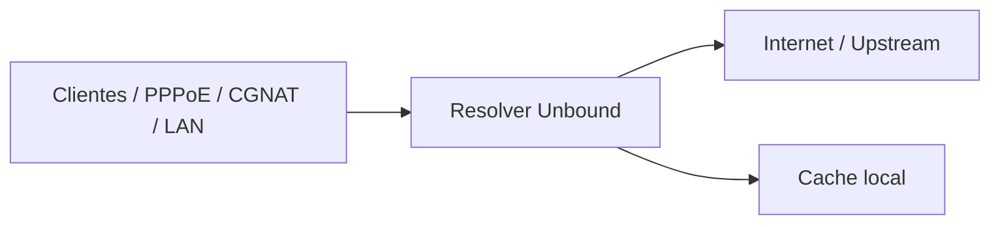

# WBSuporte DNS

Servidor DNS recursivo baseado em Unbound, executando em containers Docker e preparado para uso em infraestrutura de provedores de internet.

## Visão geral

Este projeto oferece uma base moderna para operação de resolução DNS com foco em:

- alta performance
- privacidade e minimização de exposição
- validação DNSSEC
- cache otimizado
- controle de acesso por rede
- implantação simples com Docker Compose
- adaptação para ambientes ISP e produção

## Principais recursos

- Unbound em container
- resolução recursiva com DNSSEC
- zones com root hints e suporte a arquitetura hyperlocal
- cache com TTL e parâmetros ajustados para produção
- ACL por rede e controle de clientes autorizados
- healthcheck de configuração
- remote control local para manutenção
- topologia de produção para ISP em arquivo separado

## Arquitetura



O projeto foi estruturado para evoluir de um resolver simples para uma arquitetura de produção ISP, com múltiplos nós e monitoramento centralizado.

## Estrutura do repositório

```text
.
├── conf/
│   ├── unbound.conf
│   └── conf.d/
├── data/
├── docs/
│   ├── isp-production-architecture.md
│   ├── isp-arquitetura-final.md
│   ├── isp-operacao-producao.md
│   └── implantacao-isp.md
├── monitoring/
│   ├── prometheus.yml
│   └── alert-rules.yml
├── scripts/
│   ├── deploy-isp.sh
│   └── dns-healthcheck.sh
├── Dockerfile
├── docker-compose.yml
├── docker-compose.isp.yml
├── entrypoint.sh
├── README.md
└── .gitignore
```

## Requisitos

- Docker
- Docker Compose
- Linux
- portas 53/tcp e 53/udp liberadas conforme a rede de clientes

## Implantação rápida

Clone o repositório:

```bash
git clone https://github.com/wbsuporte/wbsuporte-dns.git
cd wbsuporte-dns
```

Inicie a stack padrão:

```bash
docker compose up -d
```

Valide a configuração:

```bash
docker compose config
```

Verifique o status dos containers:

```bash
docker compose ps
```

## Arquitetura ISP / produção

Além da stack básica, o projeto inclui uma topologia de produção para provedor com milhares de clientes:

- múltiplos nós de resolver
- monitoramento via Prometheus e Grafana
- alertas de latência e falhas
- documentação de failover e operação

Arquivo principal da arquitetura ISP:

- [docker-compose.isp.yml](docker-compose.isp.yml)

Documentação relevante:

- [docs/isp-production-architecture.md](docs/isp-production-architecture.md)
- [docs/isp-arquitetura-final.md](docs/isp-arquitetura-final.md)
- [docs/isp-operacao-producao.md](docs/isp-operacao-producao.md)
- [docs/implantacao-isp.md](docs/implantacao-isp.md)

## Segurança e operação

O projeto inclui recomendações para:

- ACLs por rede
- isolamento do controle remoto
- monitoramento de cache, latência e SERVFAIL
- failover e rollback
- implantação controlada em ambientes profissionais

## Observabilidade

A stack ISP inclui:

- Prometheus para coleta
- Grafana para visualização
- alertas por indisponibilidade e degradação de serviço

## Uso recomendado

Este projeto é indicado para:

- provedores de internet em ambientes controlados
- redes locais e regionais com necessidade de resolução privada/recursiva
- cenários com múltiplos clientes e demanda crescente

## Observações finais

A solução é uma boa base para resolver DNS recursivo moderno, e a versão de produção ISP amplia a resiliência e a governança operacional do projeto, mantendo a mesma base tecnológica mas com foco em estabilidade, segurança e escalabilidade.

## Licença

Este projeto é mantido para fins de infraestrutura e operação de DNS em ambientes profissionais. Ajustes de política, ACL e deploy em produção devem ser avaliados conforme o ambiente real do provedor.
