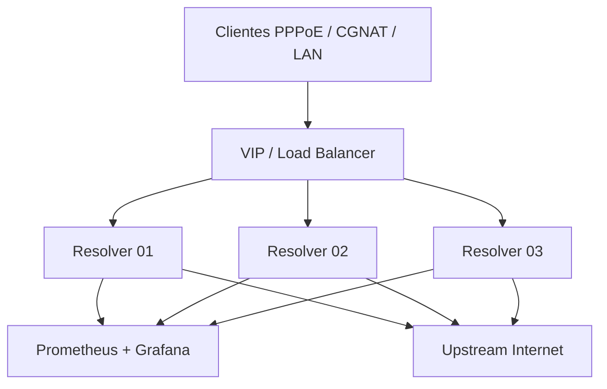

# Arquitetura final para ISP

## Visão geral

A solução evolui de um resolver único para uma arquitetura de produção orientada a provedores de internet, com múltiplos nós, entrada por VIP, separação de redes e observabilidade contínua.

## 1) Camadas da arquitetura

### Camada de cliente

- clientes da rede do ISP
- PPPoE / CGNAT / LAN corporativa
- resolução pública por IP VIP

### Camada de DNS

- 3 nós de Unbound isolados por processo
- cache local por nó
- DNSSEC habilitado e monitorado
- cada nó com configuração e logs próprios

### Camada de monitoramento

- Prometheus para coleta
- Grafana para visualização
- alertas para latência, SERVFAIL e indisponibilidade

### Camada de operação

- políticas de rollback
- validação de configuração antes do deploy
- manutenção sem impacto para clientes

## 2) Regras de rede e segurança

- rede de clientes separada da rede administrativa
- acesso ao DNS da porta 53 apenas para redes autorizadas
- controle remoto somente via rede interna e local
- firewall em borda com rate limit por prefixo
- `no-new-privileges` e processo em execução reduzido

Exemplo de política mínima:

- permitir UDP/TCP 53 apenas da rede do ISP e dos clientes autorizados
- bloquear 8953 da rede pública
- bloquear acesso a serviços de gestão de fora da rede interna

## 3) Estratégia de failover e alta disponibilidade

### Princípio

O objetivo é que a falha de um resolver não impacte os clientes.

### Obrigatório

- manter ao menos 2 nós ativos por região
- usar VIP ou load balancer para distribuir o tráfego
- validar cada nó antes de colocá-lo em produção
- monitorar p95 de latência e taxa de erros

### Recomendado

- qualquercast em regiões diferentes
- DNS em múltiplas regiões para resiliência geográfica
- política de retirada de nó para manutenção

## 4) Checklist operacional

### Antes do deploy

- validar `unbound-checkconf`
- validar ACLs e redes autorizadas
- verificar bind de volumes e permissão de escrita
- confirmar que os exporters estão acessíveis
- verificar alertas e dashboards

### Durante o deploy

- rolar por nó
- testar consultas reais
- observar latência e QPS
- confirmar sem SERVFAIL em massa

### Em caso de falha

- remover o nó do VIP imediatamente
- verificar logs e métricas
- fazer rollback de configuração
- confirmar restabelecimento do fluxo

## 5) Indicadores de serviço (SLO)

Para ambiente ISP, os principais indicadores são:

- disponibilidade do serviço > 99,9%
- p95 de latência do DNS < 100-200 ms em rede local
- hit rate do cache acima de 60-70% dependendo do tipo de tráfego
- zero picos de SERVFAIL em massa

## 6) Conclusão

Esta arquitetura final representa uma evolução saudável para o projeto: de resolver funcional para plataforma DNS de provedor. O conjunto já tem a base correta para:

- baixa latência
- tolerância a falhas
- segurança por rede
- monitoramento e operação real

O restante da evolução depende do ambiente do provedor: número de clientes, número de pontos de presença, políticas de rede e infraestrutura de load balancing.
