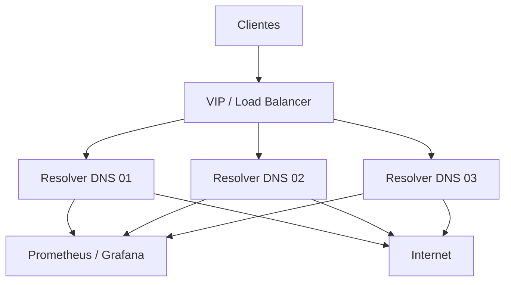

# Operação de produção para ISP

## 1) Topologia recomendada

A base ideal para um provedor com milhares de clientes é:

- 2 a 3 nós de resolvers por região
- VIP ou load balancer para entrada do serviço
- redes separadas para clientes, gestão e upstream
- Prometheus e Grafana para observabilidade
- políticas de failover, rollback e monitoramento automatizado

## 2) Estratégia de failover

Em produção, cada nó deve ser tratado de forma independente:

- o VIP ou LB deve distribuir a carga entre os resolvers
- um resolver pode ser retirado sem impactar a massa de clientes
- em caso de falha, o nó deve voltar para o cluster depois de validação

Recomendações:

- manter a mesma versão de configuração em todos os nós
- validar `unbound-checkconf` antes de ativar a nova configuração
- testar mudanças em um nó e depois rolar para o restante

## 3) Procedimento operacional

### Deploy de configuração

1. alterar configuração em um nó de teste
2. validar com `unbound-checkconf`
3. verificar saúde do resolver
4. rolar para o próximo nó
5. confirmar a resposta em consultas reais

### Rollback

- manter a configuração anterior em repositório
- reverter em ordem reversa
- confirmar `up` dos nós no monitoramento

## 4) Checklist de produção

- ACLs restritas ao cliente real
- controle remoto somente em rede interna
- firewall e rate limit habilitados
- monitoramento de cache e latência
- alertas para SERVFAIL e indisponibilidade
- testes de manutenção sem interrupção

## 5) O que o projeto já entrega e o que ainda é necessário

### Já entregues

- estrutura básica de resolver
- cache e DNSSEC
- hardening de acesso e segurança
- arquitetura multi-nó de base
- observabilidade inicial

### Ainda recomendados

- balanceador de entrada em produção
- VIP/Anycast para clientes
- operação distribuída por região
- integração com ferramenta de alerta e escalonamento

## 6) Conclusão

O projeto hoje já é um bom ponto de partida para uma arquitetura de DNS em ambiente ISP. O passo final para produção em larga escala é passar de uma solução pontual para uma topologia de múltiplos nós, monitoramento central e governança de rollout.
