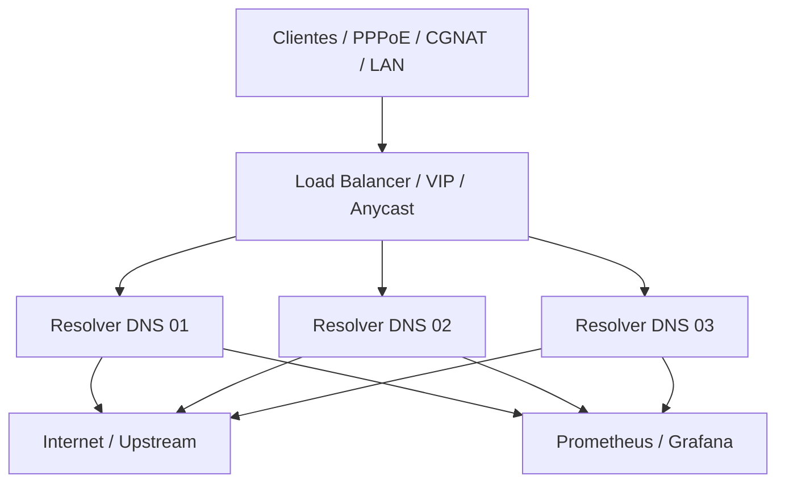

# Arquitetura de produção para ISP

## Objetivo

Esta arquitetura transforma o resolver atual em um desenho de produção mais adequado para provedores de internet com milhares de clientes, priorizando:

- alta disponibilidade
- redundância por nó
- separação de rede
- monitoramento e alertas
- fácil atualização de configuração

## Visão geral

## Componentes recomendados

### 1) Resolver DNS por nó

Cada nó executa o Unbound com:

- cache dedicado
- ajustes de threads e limites de consultas
- `so-reuseport` habilitado
- ACLs do cliente definidas por rede real
- controle remoto restrito ao host local
- logs e métricas exportadas

### 2) Balanceamento de entrada

O tráfego de clientes deve entrar por:

- VIP em hardware ou serviço de balanceamento
- anycast em regiões diferentes
- ou um LB de rede na borda do provedor

O importante é que o cliente veja um único endpoint de resolução, mesmo com múltiplos resolvers em funcionamento.

### 3) Monitoramento

Cada nó deve expor métricas para um backend central, por exemplo:

- Prometheus
- Grafana
- alertas por QPS, latência, cache hit ratio e erros de upstream

### 4) Segurança

- rede de clientes separada da rede de administração
- porta 53 restrita às faixas permitidas
- acesso ao controle remoto somente pela rede interna
- firewall e rate limit por prefixo
- `no-new-privileges` e isolamento de processos

## Recomendações de implementação

### Redundância

Usar no mínimo 2 nós por região, idealmente 3. Em redes com grande volume, a melhor prática é:

- 1 VIP por região
- 2 a 3 resolveres por VIP
- failover transparente

### Dimensionamento

Para um provedor com milhares de clientes, o dimensionamento começa por:

- CPU: 4+ núcleos por nó em ambientes médios
- memória: suficiente para cache quente e para picos de consulta
- volume de rede: largura de banda e taxa de pacotes observados em produção

### Observabilidade essencial

Monitorar:

- consultas por segundo
- cache hit ratio
- latência média e p95
- upstream timeout
- respostas SERVFAIL
- falhas de DNSSEC
- backlog de fila de consulta

### Operação

- validar `unbound-checkconf` antes do deploy
- manter uma configuração base por ambiente
- testar rollback
- documentar mudanças de política de ACL
- separar ambiente de teste e produção

## Arquitetura recomendada em etapas

### Fase 1

- 2 nós de resolver
- monitoramento básico
- ACL restrita
- logs centralizados

### Fase 2

- 3 nós em cluster
- VIP ou LB para o ponto de entrada
- alertas automáticos
- tuning de cache sob carga real

### Fase 3

- múltiplas regiões
- anycast ou balanceador geográfico
- escalabilidade por demanda
- operação programada e governança de mudanças

## Conclusão

A arquitetura atual é uma excelente base para laboratório ou resolver regional pequeno. Para ISP de grande escala, o caminho recomendado é evoluir para:

- múltiplos nós de DNS
- load balancer ou VIP
- monitoramento central
- isolamento de rede
- operação com alta disponibilidade

Esse desenho reduz o risco de indisponibilidade e melhora muito a resiliência em produção.
